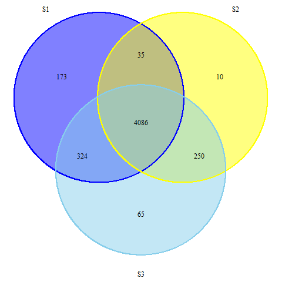

```{r libraries, message=FALSE, warning=FALSE}
library(readr)
library(gplots)
library(VennDiagram)
library(plyr)
library(dplyr)
library(knitr)
library(ggplot2)
library(reshape2)
library(rmarkdown)

```


Welcome to Reproducible Research with Rmarkdown!
=================================================

**The classy version...**


Demo: Barcode sequencing count data.

Load in the data for 3 samples. 

Each sample has a set of *uptag* and *downtag* unique barcodes for a given open reading frame (ORF).

```{r read in count data and preprocessing, echo=FALSE, eval=c(1,3)}
counts <- read_tsv("count_matrix.txt", col_names=T)
glimpse(counts)
counts$strain <- gsub("::.*", "", counts$strain) 

```


```{r counts per sample, eval=FALSE, echo=FALSE}

kable(colwise(sum, na.rm=T)(counts[,-1]))

```

##Summary table.


```{r summary, echo=FALSE}
kable(summary(counts), caption = "Aligned Read Counts per Library Prep")
```


##What does the count distribution look like?  


```{r count distributions, echo=FALSE, warning=FALSE}
count_melt<-melt(counts, id.vars="strain", variable.name="Tag.ID", value.name="Counts")

#density plot
ggplot(count_melt, aes(x=Counts, fill=Tag.ID, alpha=0.3)) + geom_density() + theme_bw() + geom_vline(xintercept=20) + xlim(1,1000)
#logscale
ggplot(count_melt, aes(x=log2(Counts), fill=Tag.ID, alpha=0.3)) + geom_density() + theme_bw() + geom_vline(xintercept=log2(20)) 

```


##Are there any outliers?


```{r boxplot, echo=FALSE, warning=FALSE}

ggplot(count_melt, aes(x=Tag.ID, y=log2(Counts), color=Tag.ID)) + geom_boxplot() + theme_bw()

```


**Looks like S1 has a major outlier...**


```{r find outlier, echo=FALSE}
kable(counts %>% arrange(desc(S1_down)) %>% head(1))
```


>YDL227C is the HO deletion strain. It is also the WT/standard control strain - the KanMX deletion cassette in the HO locus and its deletion has no effect on growth. 1078 times on the plate...


##Set a threshold and subset samples.

```{r subset samples, echo=FALSE}
S1 <- filter(counts, S1_up >= 20 | S1_down >=20) %>% select(strain, S1_up, S1_down)

S2 <- filter(counts, S2_up >= 20 | S2_down >=20) %>% select(strain, S2_up, S2_down)

S3 <- filter(counts, S3_up >= 20 | S3_down >=20) %>% select(strain, S3_up, S3_down)

```


What is the overlap between S3, S2 and S1 plate strain lists and barcodes above the 20 count threshold by sequencing? (Uptag and downtag counts together >=20)


```{r venn, echo=FALSE, eval=FALSE}
S1_strain <- sort(unique(S1$strain))

S2_strain <- sort(unique(S2$strain))

S3_strain <- sort(unique(S3$strain))

master <- list(S1=S1_strain, S2=S2_strain, S3=S3_strain)

venn(master)

```


```{r prettier venn, include=FALSE}
png("venn.png")
draw.triple.venn(area1 = 4618, area2 = 4381, area3 = 4725, n12 = 4121, n23 = 4336, n13= 4410, n123 = 4086, category = c("S1", "S2", "S3"),fill = c("blue", "yellow", "skyblue"), cat.pos=c(330,30,180),lty=c(1,1,1),col=c("blue", "yellow", "skyblue"), cat.dist=c(0.05,0.05,0.05))
dev.off()
```



##Spot check sequencing data for YFG.


```{r find YFG, echo=FALSE}

#ARG8
kable(counts[grep("YOL140W", counts$strain, fixed=TRUE),])

#CPA2
kable(counts[grep("YJR109C", counts$strain, fixed=TRUE),])

#SOD1
kable(counts[grep("YJR104C", counts$strain, fixed=TRUE),])


```


##Correlations of uptags and downtags for each sample.

```{r correlation S3, echo=FALSE}

#remove rows with NA, ie. only one tag
S3_tags <- na.omit(S3)
#big reduction here compared to S2... we need both tags present abv bg... more solo tags in S3
S3_tags <- filter(S3_tags, S3_down >= 20 & S3_up >=20 & S3_down <= 1500 & S3_up <=1500)

S3fit <- lm(S3_up~S3_down, S3_tags)


ggplot(S3_tags, aes(x=S3_tags$S3_down, y=S3_tags$S3_up)) + geom_point() + geom_smooth(method=lm, se=FALSE) + geom_text(label=paste("r^2=", round(summary(S3fit)$r.squared,2)), x=100, y=1500) + xlim(0,1500) + ylim(0,1500) + ggtitle("Sample 3")

```

```{r correlation S1, echo=FALSE, eval=c(-4)}

#remove rows with NA, ie. only one tag
S1_tags <- na.omit(S1)

#remove all tags that aren't there - ie. have a value of <20
S1_tags <- filter(S1_tags, S1_down >= 20 & S1_up >=20 & S1_down <=1500 & S1_up <=1500)


S1fit <- lm(S1_up~S1_down, S1_tags)


ggplot(S1_tags, aes(x=S1_tags$S1_down, y=S1_tags$S1_up)) + geom_point() + geom_smooth(method=lm, se=FALSE)+ geom_text(label=paste("r^2=", round(summary(S1fit)$r.squared,2)), x=100, y=1500) + xlim(0,1500) + ylim(0,1500) + ggtitle("Sample 1")

```

```{r correlation S2, echo=FALSE}

#remove rows with NA, ie. only one tag
S2_tags <- na.omit(S2)
#remove all tags that aren't there - ie. have a value of <20
S2_tags <- filter(S2_tags, S2_down >= 20 & S2_up >=20 & S2_down <= 1500 & S2_up <=1500)

S2fit <- lm(S2_up~S2_down, S2_tags)

ggplot(S2_tags, aes(x=S2_tags$S2_down, y=S2_tags$S2_up)) + geom_point() + geom_smooth(method=lm, se=FALSE)+ geom_text(label=paste("r^2=",round(summary(S2fit)$r.squared,2)), x=200, y=1000) + xlim(0,1500) + ylim(0,1500) + ggtitle("Sample 2")

```


+------+--------------------------+
|Sample Uptag/Downtag Correlations|
+======+=============+
| S1    `r cor(S1_tags$S1_up, S1_tags$S1_down)`|
+------+----------------+
| S2    `r cor(S2_tags$S2_down, S2_tags$S2_up)`|
+------+----------------+
| S3    `r cor(S3_tags$S3_up, S3_tags$S3_down)`|
+------+----------------+


*Thanks for coming to R Study Group!*

https://github.com/minisciencegirl/studyGroup

Or a descriptive link:

[R Study Group](https://github.com/minisciencegirl/studyGroup)

